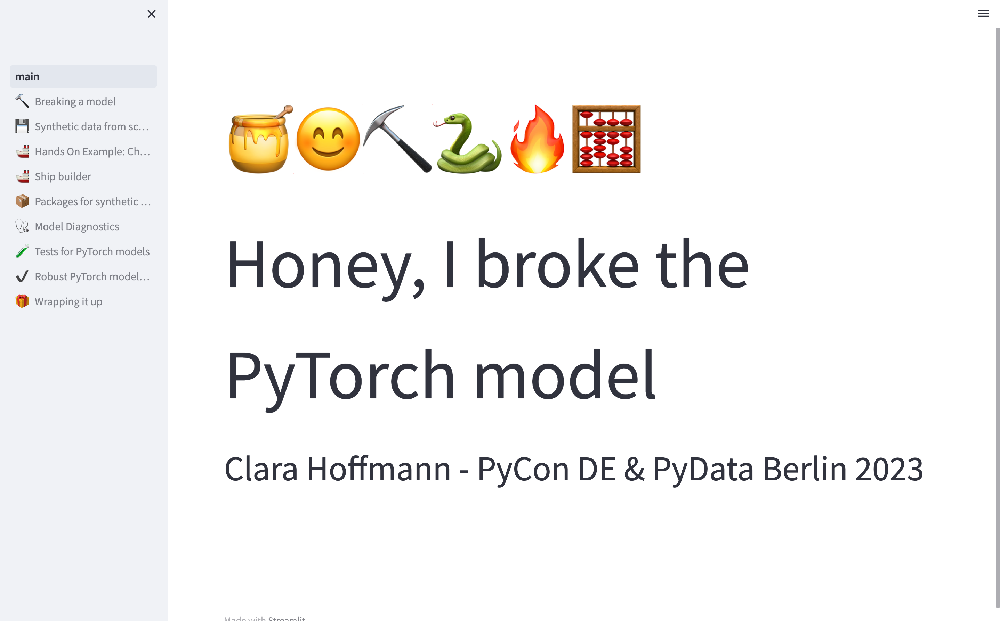

# Honey, I broke the PyTorch model
# 🍯😊⛏️🐍🔥🧮
# Talk at PyCon.DE & PyData Berlin 2023


Are you ready to lift the veil from your broken PyTorch model and prevent it from
ever breaking again?
This presentation covers strategies to
1. Create synthetic data for your custom ML model and
2. Setup an adequate test suite to speed up your ML dev process

To run the streamlit app, follow the steps below:
## 1. Set-up

Activate the [poetry](https://python-poetry.org/docs/managing-environments/) environment
```
poetry shell
```

and run the presentation

```
streamlit run Home.py
```

The presentation should now be available in a new browser tab




## 2. PyTorch examples
All PyTorch code is contained in ```pages/torch_examples```


## 3. Sources & further reading

### Testing in ML
- [Jeremy Jordan's blogpost](https://www.jeremyjordan.me/testing-ml/) about testing philosophy for ML
- Testing for PyTorch with [torchcheck](https://github.com/pengyan510/torcheck)
- Deprecated, but interesting test suites for < TF2.0: [mltest](https://github.com/Thenerdstation/mltest) and for PyTorch: [torchtest](https://github.com/suriyadeepan/torchtest)
- [Differences between Software Engineering and Machine Learning Engineering workflows](https://www.youtube.com/watch?v=7SdrrHpu8_o&t=440s) at TensorFlow explained by TF team lead

### Post-training checks
- Weight analysis without training or validation data: [weightwatcher](https://github.com/CalculatedContent/WeightWatcher)
- Post-training label quality analysis: [cleanlab](https://github.com/cleanlab/cleanlab)
- [Behavioral testing for NLP models](https://aclanthology.org/2020.acl-main.442/)

### For other bugs and better performance
- Andrej Kaparthy's [recipe for training NNs](http://karpathy.github.io/2019/04/25/recipe/)
- and if you're done debugging check out Google's [Deep Learning tuning playbook](https://github.com/google-research/tuning_playbook)
